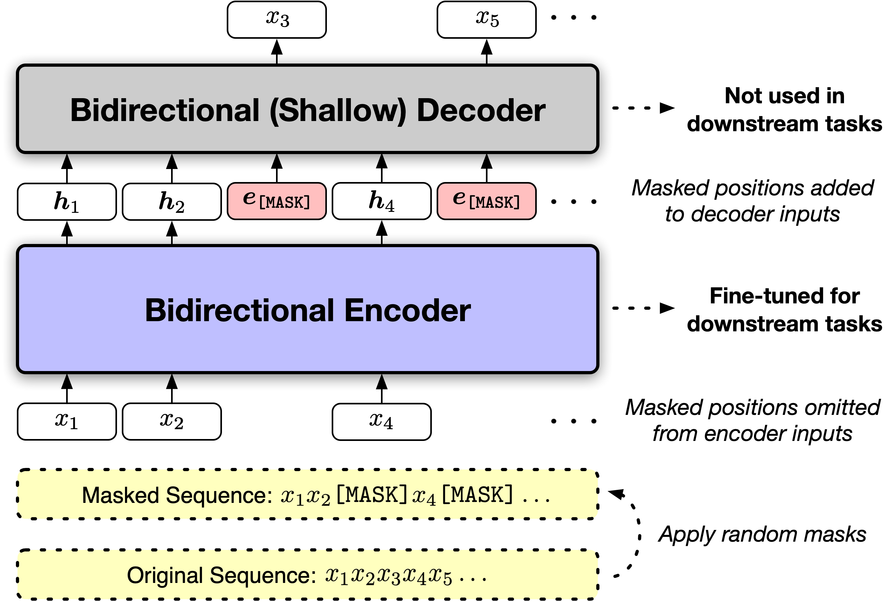

# MAE-LM

This repository contains the scripts for pretraining MAE-LM.

Paper: [Representation Deficiency in Masked Language Modeling](https://arxiv.org/abs/2302.02060)

</img>

## Requirements

The codebase is based on fairseq library. You need to install the dependencies by 
```
bash install.sh
```

## Run Pretraining

MAE-LM pretraining can be run via `run_pretrain.sh`. You need to provide the pretraining corpus and saving directory as the two input arguments to the script.

For the pretraining corpus preparation, you can refer to [this script](/MAE-LM/examples/byte_level_bpe/get_data.sh)

## Citation
If you find the code useful for your research, please cite the following paper:
```
@inproceedings{meng2024maelm,
  title={Representation Deficiency in Masked Language Modeling},
  author={Meng, Yu and Krishnan, Jitin and Wang, Sinong and Wang, Qifan and Mao, Yuning and Fang, Han and Ghazvininejad, Marjan and Han, Jiawei and Zettlemoyer, Luke},
  booktitle={International Conference on Learning Representations},
  year={2024}
}
```

